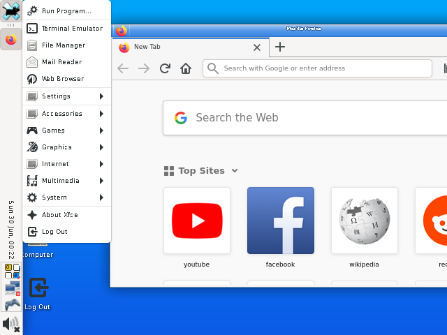

# Xorg on the R36S

This script allows the installation of Xorg on the R36S device. It also installs one of the following lightweight desktop environments: LXDE, LXQT, or XFCE.
Based on the project by MrJackSpade for the  RG35XXP (https://github.com/MrJackSpade/RG35XXP-XFCE).

To enable the use of the desktop environments, the OnBoard on-screen keyboard (https://launchpad.net/onboard) and QJoyPad (https://launchpad.net/qjoypad) are provided to allow control through the R36S buttons.

## QJoyPad Control Scheme

| Button      | Action            |
|-------------|-------------------|
| **A**       | Return key        |
| **B**       | Backspace key     |
| **Y**       | Tab key           |
| **X**       | Escape key        |
| **D-pad**   | Arrow keys        |
| **FN**      | Space key         |
| **L-stick** | Slow mouse cursor |
| **R-stick** | Fast mouse cursor |
| **R1**      | Right click       |
| **R2**      | Left click        |
| **L1**      | Scroll down       |
| **L2**      | Scroll up         |
|             |                   |

## Installation

### Using the premade image
A disk image has been made available with the device's installation and configuration already completed. To use it, you must use Rufus (https://rufus.ie/en/) or a similar program to burn the disk image onto the R36S OS SD card. The provided image has the three desktop environments installed, accessible via the options menu -> tools -> LXDE/LXQT/XFCE.

A 16GB or larger SD card is required. You might want to expand the EASYROMS partition after installing the .img file on the SD card (you can use MiniTool Partition Wizard Free to do this).

### Using the premade image
A disk image has been made available with the device's installation and configuration already completed, based on the version of ArkOS found at https://github.com/AeolusUX/ArkOS-R3XS. To use it, you must use Rufus (https://rufus.ie/en/) or a similar program to burn the disk image onto the R36S OS SD card. The provided image has the three desktop environments installed, accessible via the options menu -> tools -> LXDE/LXQT/XFCE.

A 16GB or larger SD card is required. You might want to expand the EASYROMS partition after installing the .img file on the SD card (you can use MiniTool Partition Wizard Free to do this).

### Installing on a existing SD card
Clone or Download this repository as a zip file. Then copy the LXDE, LXQT, and/or XFCE folder to the **tools** folder in the **EASYROMS** partition. Insert the SD card into the R36S and navigate to options -> tools. To install each desktop environment, open the related INSTALL file and wait for the process to complete.

The installation may take a while, so make sure the device is connected to a power source or has enough battery. An internet connection is needed to complete the installation. After completion, the device will reboot.

## Using the Desktop Environment
The desktop environments can be accessed by selecting the corresponding LAUNCH option from the tools menu within EmulationStation.

## Known Issues
> - Before launching any desktop environment, **allow the device to complete loading the files (1-2 minutes after turning on)**. If you launch before this, you might get a black screen followed by an error message. The screen will flicker with some text when finishing loading.
- This issue extends to opening games and emulators, wait for about 1-2 minutes before opening anything on the device.
- When using the SD2 for games, it has been observed that sometimes the card is unmounted or something similar occurs, preventing games from being loaded. This may be due to interference from newly installed programs (Xorg, XFCE ...). Keep this in mind before installing on your primary SD card.
- **The process is not perfect; expect bugs, crashes, and softlocks. It is recommended to install on a secondary OS SD card**.
- Clicking on QJoyPad systray icon will disable joystick mouse control. If you are going to reconfigure the controls, connect an external USB keyboard and/or mouse.

## Which Environment is Better?

In the tests conducted, LXDE proved to be the fastest to start and had the lowest RAM usage. However, it also had the most errors during use. XFCE takes a bit longer than LXDE to start and uses a bit more RAM, but it is the most stable. LXQT takes the longest to start and is the most cluttered at the low resolution of the R36S. The choice is up to the user.

## Contributions

Contributions to this project are welcomed. For those who have suggestions for improvements or wish to contribute, they are invited to fork the project and submit their changes via GitHub.